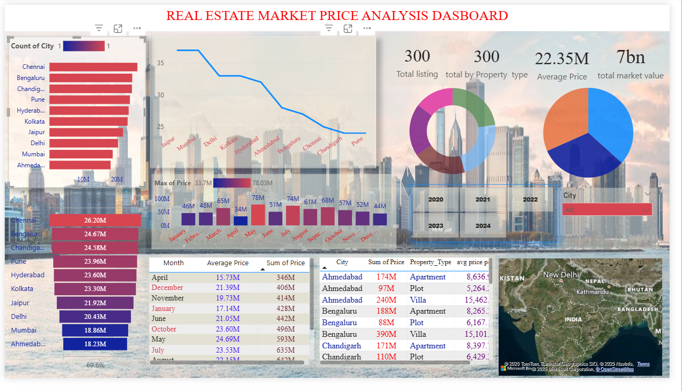

# Real Estate Market Price Analysis Dashboard

## Project Overview
This project analyzes real estate market trends across multiple cities using Power BI. 
It provides insights into property prices, listings, market value, and property types.

## Tools Used
- Excel
- SQL
- Power BI

## Key Features
- City-wise property analysis
- Monthly price trends
- Property type analysis
- Interactive dashboard filters
- Market value visualization

## Business Insights
- Bengaluru and Chennai show high property activity.
- Property prices vary significantly across cities.
- Market value trends help identify investment opportunities.
- Apartments and Villas dominate listings.

